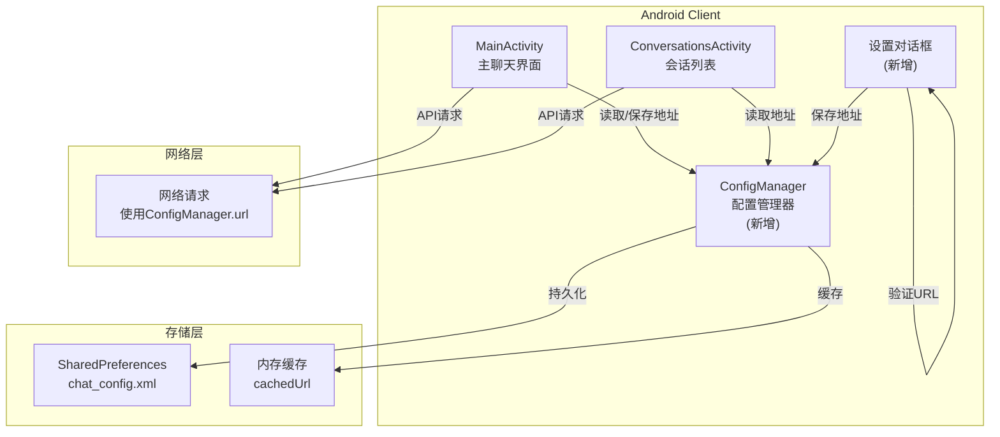

## 1. 高层摘要 (TL;DR)

*   **影响范围:** 🟡 **中** - 主要是 Android 客户端的配置管理优化，不涉及后端架构变更
*   **核心变更:**
    *   ✨ 移除所有硬编码的后端服务器地址
    *   🔧 新增 [ConfigManager](file:///home/fang/Documents/trae_projects/ragApp/android_app/app/src/main/java/com/example/agentchat/ConfigManager.kt) 统一管理配置
    *   📱 新增"服务器设置"界面，支持动态配置地址
    *   🛡️ 添加 URL 格式验证，确保合法的 http/https 协议
    *   🎨 UI 新增设置图标和菜单项

---

## 2. 问题背景

### 2.1 之前的架构问题

| 问题点 | 描述 | 影响 |
|--------|------|------|
| **硬编码地址** | BACKEND_URL 直接写在 MainActivity 和 ConversationsActivity 中 | ⚠️ 更换网络环境必须重新编译 |
| **分散管理** | 地址配置在多处，维护困难 | 🔴 容易遗漏，导致不一致 |
| **安全配置** | network_security_config.xml 需要手动添加允许的域名 | 🟡 修改地址后需同步更新 |
| **缺少验证** | 无 URL 格式检查 | 🟡 用户可能输入无效地址导致崩溃 |

### 2.2 用户痛点
- 开发者切换网络环境（从模拟器到真机）需要修改代码重新编译
- 测试不同服务器地址时需要反复修改代码
- 用户无法自行配置后端地址

---

## 3. 解决方案架构



---

## 4. 详细变更分析

### 4.1 ConfigManager 设计

**文件位置:** `android_app/app/src/main/java/com/example/agentchat/ConfigManager.kt`

**核心特性:**

| 特性 | 说明 |
|------|------|
| **持久化** | 使用 SharedPreferences 存储地址 |
| **内存缓存** | cachedUrl 变量避免频繁读取文件 |
| **默认值** | http://192.168.1.106:8000 作为默认地址 |
| **单例模式** | object 实现全局唯一实例 |

**API 设计:**

```kotlin
object ConfigManager {
    // 获取后端地址（优先级：缓存 → SharedPreferences → 默认值）
    fun getBackendUrl(context: Context): String
    
    // 保存后端地址（同时更新缓存和持久化）
    fun setBackendUrl(context: Context, url: String)
    
    // 检查是否已配置（预留接口）
    fun isConfigured(context: Context): Boolean
}
```

---

### 4.2 MainActivity 变更

**修改文件:** [MainActivity.kt](file:///home/fang/Documents/trae_projects/ragApp/android_app/app/src/main/java/com/example/agentchat/MainActivity.kt)

**移除的代码:**
```kotlin
companion object {
    // ❌ 已移除 - 不再硬编码
    private const val BACKEND_URL = "http://192.168.1.106:8000"
}
```

**新增的代码:**
```kotlin
private fun getBackendUrl(): String {
    return ConfigManager.getBackendUrl(this)
}

private fun getBackendUrlWithPath(path: String): String {
    return "${getBackendUrl()}$path"
}
```

**新增功能:**
1. `showServerConfigDialog()` - 显示服务器地址配置对话框
2. `onOptionsItemSelected()` 中新增 R.id.action_settings 处理

**所有 URL 使用处替换:**
| 原代码 | 新代码 |
|--------|--------|
| `BACKEND_URL + "/api/..."` | `getBackendUrlWithPath("/api/...")` |

---

### 4.3 ConversationsActivity 变更

**修改文件:** [ConversationsActivity.kt](file:///home/fang/Documents/trae_projects/ragApp/android_app/app/src/main/java/com/example/agentchat/ConversationsActivity.kt)

同样移除硬编码地址，改用 ConfigManager：

```kotlin
private fun getBackendUrl(): String {
    return ConfigManager.getBackendUrl(this)
}

private fun getBackendUrlWithPath(path: String): String {
    return "${getBackendUrl()}$path"
}
```

---

### 4.4 URL 格式验证

**验证逻辑 (MainActivity.kt:201-203):**
```kotlin
if (!url.startsWith("http://") && !url.startsWith("https://")) {
    Toast.makeText(this, "URL必须以http://或https://开头", Toast.LENGTH_SHORT).show()
    return@setPositiveButton
}
```

**用户体验:**
- 输入框预填充当前地址
- 保存前验证协议格式
- 不合法时提示错误，不关闭对话框

---

### 4.5 UI 资源变更

#### 菜单配置 (menu_main.xml)
```xml
<item
    android:id="@+id/action_settings"
    android:title="服务器设置"
    android:icon="@drawable/ic_settings"
    app:showAsAction="ifRoom" />
```

#### 设置图标 (ic_settings.xml)
- 标准齿轮图标，24x24 dp
- 白色填充色，与主题一致

#### Network Security Config
```xml
<!-- 保留所有可能的地址配置，确保兼容性 -->
<domain includeSubdomains="true">10.0.2.2</domain>
<domain includeSubdomains="true">192.168.1.106</domain>
<domain includeSubdomains="true">localhost</domain>
```

---

## 5. 文件清单

### 5.1 新增文件

| 文件 | 类型 | 说明 |
|------|------|------|
| `ConfigManager.kt` | Kotlin Class | 配置管理单例，提供统一的地址访问接口 |
| `ic_settings.xml` | Drawable | 设置图标（齿轮） |

### 5.2 修改文件

| 文件 | 修改内容 |
|------|---------|
| `MainActivity.kt` | 移除硬编码地址，新增配置对话框，替换所有 URL 使用处 |
| `ConversationsActivity.kt` | 移除硬编码地址，改用 ConfigManager |
| `menu_main.xml` | 添加服务器设置菜单项 |
| `network_security_config.xml` | 更新网络安全配置 |
| `README.md` | 更新 Android 应用开发说明 |
| `CHANGELOG.md` | 新增本次变更记录 |

---

## 6. 使用说明

### 6.1 用户操作流程

1. **打开设置** - 点击右上角齿轮图标
2. **输入地址** - 在对话框中输入后端服务器地址（例如 http://192.168.1.100:8000）
3. **保存配置** - 点击保存，地址立即生效
4. **无需重启** - 保存后无需重启应用，后续请求使用新地址

### 6.2 支持的地址格式

| 类型 | 示例 | 适用场景 |
|------|------|---------|
| 局域网 IP | `http://192.168.1.100:8000` | 真机调试 |
| 模拟器本地 | `http://10.0.2.2:8000` | Android 模拟器访问宿主机 |
| 本地回环 | `http://localhost:8000` | 仅限模拟器内部测试 |
| HTTPS | `https://api.example.com` | 生产环境 |

---

## 7. 技术亮点

✨ **双重缓存机制**: 内存缓存 + SharedPreferences 持久化，兼顾性能和可靠性

✨ **向后兼容**: network_security_config.xml 保留所有可能的地址配置，确保不会因为安全策略导致连接失败

✨ **渐进式验证**: 保存前检查 URL 格式，避免无效配置导致后续崩溃

✨ **无缝迁移**: 从硬编码平滑迁移到可配置，对现有功能零影响

✨ **用户友好**:
- 预填充当前地址，方便修改
- 清晰的提示信息
- 实时生效，无需重启
