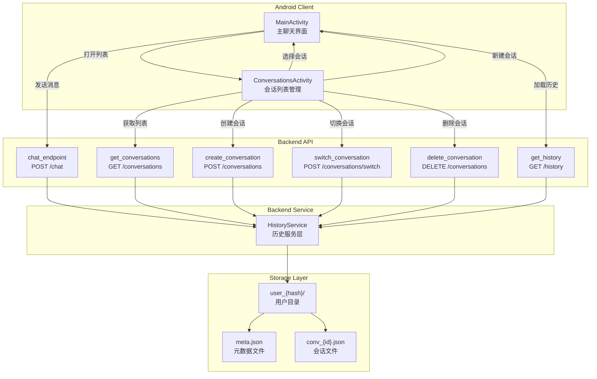
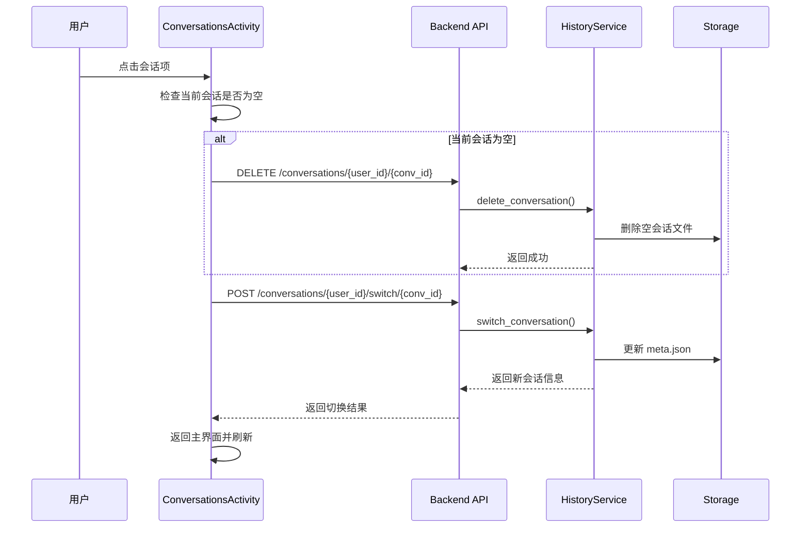

## 1. 高层摘要 (TL;DR)

*   **影响范围:** 🔴 **高** - 这是一个跨全栈的重大功能重构，涉及后端存储架构改造、API 接口扩展和 Android 客户端 UI 全面升级
*   **核心变更:**
    *   ✨ 后端从单会话存储升级为**多会话管理架构**，支持创建、切换、删除会话
    *   📱 Android 新增**会话列表管理界面**，提供完整的会话管理功能
    *   🔧 新增 5 个 REST API 端点用于会话 CRUD 操作
    *   🎨 UI 新增 Toolbar、菜单、图标等交互组件

---

## 2. 可视化架构图

### 2.1 系统架构概览



### 2.2 会话切换流程



---

## 3. 详细变更分析

### 3.1 后端服务层 (`backend/service/history_service.py`)

**核心架构改造:** 从单文件存储升级为**目录化多会话存储**

| 存储方式 | 旧架构 | 新架构 |
|---------|--------|--------|
| **文件结构** | `history_{hash}.json` | `user_{hash}/meta.json` + `conv_{id}.json` |
| **会话隔离** | ❌ 无 | ✅ 每个会话独立文件 |
| **元数据管理** | ❌ 无 | ✅ meta.json 存储会话列表和当前会话 |
| **扩展性** | 🔴 低 | 🟢 高 |

**新增核心方法:**

| 方法名 | 功能 | 关键逻辑 |
|--------|------|---------|
| `create_conversation()` | 创建新会话 | 自动清理空会话，生成 UUID，更新元数据 |
| `get_conversations()` | 获取会话列表 | 从 meta.json 读取并返回会话数组 |
| `switch_conversation()` | 切换当前会话 | 更新 meta.json 中的 current_conv 字段 |
| `delete_conversation()` | 删除会话 | 删除文件 + 更新元数据 + 自动切换到其他会话 |
| `ensure_default_conversation()` | 确保存在默认会话 | 如果无会话则自动创建第一个会话 |

**修改的方法签名:**

```python
# 旧版本
def save_message(self, user_id: str, role: str, content: str)
def load_history(self, user_id: str, limit: Optional[int] = None)
def clear_history(self, user_id: str) -> bool
def get_history_count(self, user_id: str) -> int

# 新版本 - 全部新增 conv_id 参数
def save_message(self, user_id: str, conv_id: str, role: str, content: str)
def load_history(self, user_id: str, conv_id: Optional[str] = None, limit: Optional[int] = None)
def clear_history(self, user_id: str, conv_id: Optional[str] = None) -> bool
def get_history_count(self, user_id: str, conv_id: Optional[str] = None) -> int
```

---

### 3.2 后端 API 层 (`backend/api/chat.py`)

**新增数据模型:**

```python
class ConversationInfo(BaseModel):
    conv_id: str
    title: str
    created_at: str
    message_count: int
    last_message: str = ""
```

**新增 REST API 端点:**

| 端点 | 方法 | 功能 | 请求参数 | 响应 |
|------|------|------|---------|------|
| `/conversations/{user_id}` | POST | 创建会话 | `title` (可选) | `{"status": "success", "conversation": {...}}` |
| `/conversations/{user_id}` | GET | 获取会话列表 | - | `{"user_id": "...", "conversations": [...], "count": N}` |
| `/conversations/{user_id}/switch/{conv_id}` | POST | 切换会话 | - | `{"status": "success", "conversation": {...}}` |
| `/conversations/{user_id}/{conv_id}` | DELETE | 删除会话 | - | `{"status": "success", "current_conv": "..."}` |
| `/conversations/{user_id}/{conv_id}/title` | PUT | 更新标题 | `title` | `{"status": "success", "title": "..."}` |

**修改现有端点:**

| 端点 | 修改内容 |
|------|---------|
| `POST /chat` | 新增 `conv_id` 参数，响应中返回当前会话 ID |
| `GET /history/{user_id}` | 新增可选 `conv_id` 查询参数 |
| `DELETE /history/{user_id}` | 新增可选 `conv_id` 参数，支持清空单个会话 |
| `GET /history/{user_id}/count` | 新增可选 `conv_id` 参数 |

---

### 3.3 Android 客户端

#### 3.3.1 新增文件清单

| 文件路径 | 类型 | 说明 |
|---------|------|------|
| `ConversationsActivity.kt` | Activity | 会话列表管理界面（373 行） |
| `activity_conversations.xml` | Layout | 会话列表布局 |
| `item_conversation.xml` | Layout | 会话列表项布局 |
| `ic_add.xml` | Drawable | 新建对话图标 |
| `ic_back.xml` | Drawable | 返回图标 |
| `ic_delete.xml` | Drawable | 删除图标 |
| `menu_main.xml` | Menu | 主界面菜单 |

#### 3.3.2 MainActivity 核心变更

**新增成员变量:**
```kotlin
private var currentConvId: String? = null
private var currentConvTitle: String = "智能助手"
```

**新增功能:**

| 功能 | 方法 | 实现要点 |
|------|------|---------|
| 打开会话列表 | `openConversationsActivity()` | 通过 startActivityForResult 启动 |
| 处理返回结果 | `onActivityResult()` | 接收新会话 ID 并刷新界面 |
| 新建对话 | `startNewConversation()` | 检查当前会话是否为空，避免创建空会话 |
| 清除历史 | `clearHistoryOnServer()` | 支持清除当前会话历史 |

**Toolbar 集成:**
```kotlin
val toolbar = findViewById<Toolbar>(R.id.toolbar)
setSupportActionBar(toolbar)
supportActionBar?.title = currentConvTitle
supportActionBar?.setDisplayHomeAsUpEnabled(true)
```

#### 3.3.3 ConversationsActivity 核心逻辑

**数据模型:**
```kotlin
data class Conversation(
    val convId: String,
    val title: String,
    val createdAt: String,
    val messageCount: Int,
    val lastMessage: String = ""
)
```

**关键方法:**

| 方法 | 功能 | 业务逻辑 |
|------|------|---------|
| `loadConversations()` | 加载会话列表 | 调用 API 获取并显示，空状态处理 |
| `createNewConversation()` | 创建新会话 | 检查当前会话是否为空，避免创建空会话 |
| `selectConversation()` | 选择会话 | 如果当前会话为空则先删除，再切换 |
| `deleteEmptyConversation()` | 删除空会话 | 异步删除后切换到目标会话 |
| `switchToConversation()` | 切换会话 | 调用 API 并返回主界面 |

**RecyclerView 适配器特性:**
- 显示会话标题、时间、消息预览、消息数量
- 当前会话有蓝色标记指示器
- 支持点击切换和删除操作
- 时间格式化（刚刚、N分钟前、N小时前、MM-dd）

---

### 3.4 资源文件变更

#### AndroidManifest.xml
```xml
<activity
    android:name=".ConversationsActivity"
    android:exported="false" />
```

#### UI 布局结构调整

| 文件 | 变更类型 | 说明 |
|------|---------|------|
| `activity_main.xml` | 重构 | 新增 Toolbar，调整布局层级 |
| `activity_conversations.xml` | 新增 | 会话列表界面，包含返回、标题、新建按钮 |
| `item_conversation.xml` | 新增 | 会话列表项，显示标题、预览、计数、删除按钮 |

---

## 4. 影响与风险评估

### 4.1 破坏性变更 ⚠️

| 组件 | 变更内容 | 影响范围 |
|------|---------|---------|
| **HistoryService** | 所有方法签名新增 `conv_id` 参数 | 后端所有调用该服务的代码 |
| **存储结构** | 从单文件改为目录结构 | 需要数据迁移或兼容旧数据 |
| **API 响应** | 新增 `conv_id` 字段 | 客户端需适配新响应格式 |

### 4.2 潜在风险

| 风险项 | 描述 | 缓解措施 |
|--------|------|---------|
| 🔴 **数据丢失** | 旧架构数据无法直接读取 | 需要数据迁移脚本或兼容层 |
| 🟡 **空会话堆积** | 频繁创建空会话未清理 | 已实现自动清理逻辑（第 79-98 行） |
| 🟡 **并发冲突** | 多端同时操作同一会话 | 当前无锁机制，建议后续添加 |
| 🟡 **网络异常** | 会话切换失败处理 | 已有 Toast 提示，但可优化重试机制 |

### 4.3 测试建议

| 测试场景 | 验证点 |
|---------|--------|
| **新建会话** | 当前会话为空时不创建新会话，有消息时正常创建 |
| **切换会话** | 切换后消息列表正确加载，标题更新 |
| **删除会话** | 删除后自动切换到其他会话，空状态显示 |
| **清除历史** | 只清除当前会话，不影响其他会话 |
| **网络异常** | API 失败时有友好提示，不崩溃 |
| **数据持久化** | 重启应用后会话列表和当前会话保持 |

---

## 5. 技术亮点

✨ **智能空会话清理:** 创建新会话时自动检查并删除当前空会话，避免数据冗余

✨ **优雅的降级策略:** 切换会话时，如果删除空会话失败仍继续切换，保证用户体验

✨ **时间智能格式化:** 根据时间差动态显示"刚刚"、"N分钟前"、"N小时前"或日期

✨ **响应式 UI:** 空状态自动显示/隐藏，当前会话有视觉标记

✨ **向后兼容设计:** `conv_id` 参数可选，不传时使用当前会话