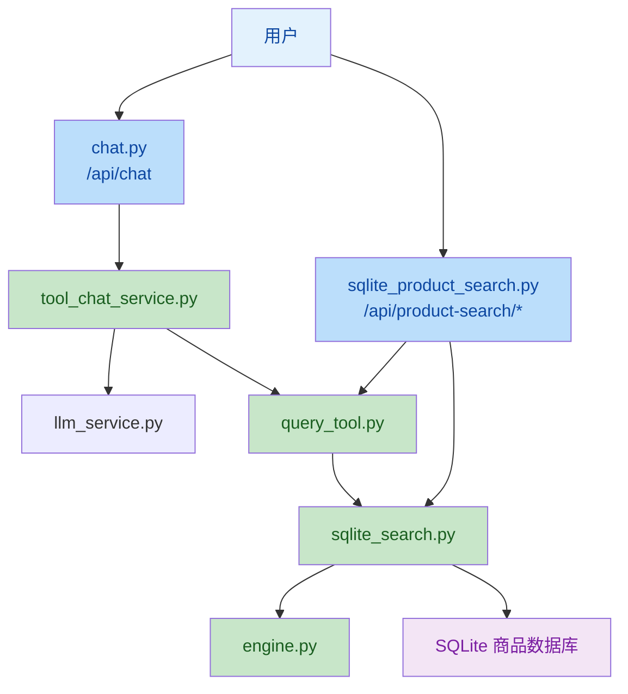

# 查询工具接入后端说明

## 1. 当前实现对照

这份文档描述的是“查询工具接入后端”的演进过程，但当前实现已经收敛为标准 Function Calling + 导购流式编排链路。

| 旧描述 | 当前实现 |
|------|------|
| 自定义 JSON 工具解析 | 原生 OpenAI Function Calling |
| `ecommerce_service.py` | `backend/service/product_search/query_tool.py` + `backend/service/product_search/sqlite_search.py` |
| `query_engine.py` | `backend/service/product_search/engine.py` |
| `backend/api/ecommerce.py` | `backend/api/sqlite_product_search.py` |
| RAG 直接拼工具逻辑 | `backend/service/tool_chat_service.py` + `backend/service/tool_chat/` |

---

## 2. 高层摘要

*   **影响范围：** 🔴 **高** - 影响后端工具调用方式、商品查询入口和流式导购链路
*   **核心变更：**
    *   🔧 工具调用改为原生 OpenAI Function Calling
    *   🧠 商品查询逻辑拆分为查询引擎、SQLite 搜索服务和工具分发层
    *   🔄 导购链路由 `tool_chat_service.py` 统一编排
    *   📡 `/api/chat` 保持为主入口，`/api/product-search/*` 提供调试和联调接口
    *   📊 流式事件中保留 `status`、`analysis`、`rag_sources`、`selected_products` 等结构化字段

---

## 3. 架构映射

---

## 4. 关键模块职责

### 4.1 `backend/service/product_search/query_tool.py`

- 定义 `query_products` 工具规范
- 负责工具参数到查询服务的分发
- 兼容自然语言与结构化查询

### 4.2 `backend/service/product_search/sqlite_search.py`

- 执行 SQLite 商品检索
- 聚合商品、SKU、FAQ、评价与图片信息
- 为调试页面和导购工具提供统一数据源

### 4.3 `backend/service/product_search/engine.py`

- 处理品牌、类目、属性等语义解析
- 完成 SearchPlan 和查询条件标准化
- 负责自然语言向结构化条件的转换

### 4.4 `backend/service/tool_chat_service.py`

- 编排需求分析、RAG、商品直查和工具循环
- 汇总 `rag_sources` 和 `selected_products`
- 为 `/api/chat` 提供最终流式回复

---

## 5. 现在的行为

1. 用户在 Android 端发送消息。
2. `/api/chat` 进入 `tool_chat_service.py`。
3. 后端并行执行需求分析、知识库检索、SearchPlan 解析和商品直查。
4. 如果 LLM 需要补充结构化商品信息，则通过 `query_products` 工具查询 SQLite 数据库。
5. 最终回复会基于真实商品结果和 RAG 片段生成，避免编造不存在的商品信息。

---

## 6. 调试与联调接口

| 端点 | 说明 |
|------|------|
| `/api/product-search/search/text` | 自然语言商品搜索 |
| `/api/product-search/search` | 结构化商品搜索 |
| `/api/product-search/tool/spec` | 工具规范 |
| `/api/product-search/tool/run` | 工具调用复现 |
| `/api/product-search/health` | 服务健康检查 |

---

## 7. 结论

当前“查询工具接入后端”的实现已经不再依赖旧版的 `EcommerceService` 和自定义 JSON 解析，而是采用 `query_products` 工具 + `tool_chat_service.py` 的标准化链路。今后查阅和维护时，应以 `backend/service/product_search/` 和 `backend/service/tool_chat/` 下的文件为准。
