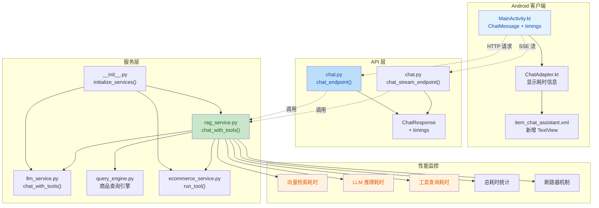

## 1. 高层摘要 (TL;DR)

*   **影响范围**：🔴 **高** - 涉及后端核心架构重构、API 接口变更、Android 客户端更新
*   **核心变更**：
    *   🔧 将自定义 JSON 解析的工具调用机制升级为原生 OpenAI Function Calling
    *   📊 新增全链路性能监控（向量检索、LLM 推理、工具查询耗时统计）
    *   🏗️ 统一服务层初始化管理，优化代码组织结构
    *   📱 Android 客户端新增耗时信息展示
    *   📦 将查询引擎从数据集目录迁移到后端服务层

---

## 2. 可视化概览 (架构与逻辑映射)



---

## 3. 详细变更分析

### 3.1 🔧 后端核心架构重构

#### **服务层统一管理** (`backend/service/__init__.py`)

| 变更类型 | 说明 |
|---------|------|
| **新增函数** | `initialize_services()` - 统一初始化所有服务（LLM、Embedding、向量库、RAG、电商） |
| **新增函数** | `cleanup_services()` - 统一清理所有服务资源 |
| **依赖管理** | 通过 `importlib` 动态更新 `rag_service` 实例，解决循环依赖问题 |

**关键逻辑**：
```python
def initialize_services():
    llm_service.initialize()
    embedding_service.initialize()
    vector_store.initialize()
    
    # 动态更新 rag_service 实例
    _rag_mod = importlib.import_module(".rag_service", package=__name__)
    _rag_mod.rag_service = RAGService(vector_store, llm_service)
    globals()["rag_service"] = _rag_mod.rag_service
```

#### **LLM 服务增强** (`backend/service/llm_service.py`)

| 新增方法 | 功能描述 |
|---------|---------|
| `chat_with_tools()` | 支持原生 OpenAI Function Calling，接收 `tools` 和 `tool_choice` 参数 |

#### **RAG 服务重构** (`backend/service/rag_service.py`)

**核心变更**：

| 变更项 | 旧实现 | 新实现 |
|-------|--------|--------|
| 工具调用方式 | 自定义 JSON 解析 (`_parse_tool_calls()`) | 原生 Function Calling |
| 返回值类型 | `str` | `Dict[str, Any]` (包含 `reply` 和 `timings`) |
| 流式接口 | `chat_with_rag_stream_with_thinking()` | 简化为单次 `chat_with_tools()` 调用 |
| 思考内容 | 支持流式输出 | 已移除 |

**新增功能**：

1. **性能监控** - 新增 `_print_timings_summary()` 方法
   ```python
   {
       "vector_search": 0.123,  # 向量检索耗时
       "llm_calls": 1.456,      # LLM 推理总耗时
       "llm_rounds": 3,         # LLM 调用轮数
       "tool_calls": 0.234,     # 工具查询总耗时
       "tool_rounds": 2,        # 工具调用轮数
       "total": 1.813           # 总耗时
   }
   ```

2. **断路器机制** - 防止空参数循环调用
   ```python
   if consecutive_empty_params >= 2:
       print("🛑 断路器触发：连续空参数，提前退出工具循环")
       break
   ```

3. **历史上下文增强** - `_build_history_context()` 方法
   - 从对话历史中提取商品 ID、品牌名、商品名
   - 注入到 system prompt 帮助 LLM 定位关键词

#### **查询引擎迁移** (`backend/service/query_engine.py`)

| 变更项 | 说明 |
|-------|------|
| **源路径** | `ecommerce_agent_dataset/query_sqlite_with_synonyms.py` |
| **目标路径** | `backend/service/query_engine.py` |
| **路径调整** | 数据文件路径改为相对于 `backend/` 的父目录 |

---

### 3.2 🌐 API 层变更

#### **Chat API** (`backend/api/chat.py`)

| 变更项 | 说明 |
|-------|------|
| **模型更新** | `ChatResponse` 新增 `timings: Optional[Dict[str, Any]]` 字段 |
| **接口重构** | `chat_endpoint()` 改为调用 `rag_service.chat_with_tools()` |
| **流式简化** | `chat_stream_endpoint()` 移除思考内容流式，改为单次完整返回 |
| **导入统一** | 所有服务导入改为 `from service import xxx` |

**关键代码变更**：
```python
# 旧实现
reply = await rag_service.chat_with_rag(user_query, history)

# 新实现
result = await rag_service.chat_with_tools(user_query, history)
reply = result["reply"]
timings = result.get("timings")
```

#### **其他 API 统一**

| 文件 | 变更 |
|------|------|
| `ecommerce.py` | 所有导入改为 `from service import ecommerce_service` |
| `knowledge.py` | 所有导入改为 `from service import vector_store` |

---

### 3.3 📱 Android 客户端更新

#### **数据模型** (`MainActivity.kt`)

| 字段 | 类型 | 说明 |
|------|------|------|
| `timings` | `Map<String, Any>?` | 新增，存储各环节耗时数据 |

```kotlin
data class ChatMessage(
    val role: String,
    val content: String,
    val thinking: String? = null,
    val timings: Map<String, Any>? = null  // 新增
)
```

#### **UI 展示** (`ChatAdapter.kt` + `item_chat_assistant.xml`)

| 变更项 | 说明 |
|-------|------|
| **布局方向** | 从 `horizontal` 改为 `vertical` |
| **新增控件** | `assistantTimingsText` TextView (默认隐藏) |
| **显示逻辑** | 解析 `timings` 数据，格式化为 "向量检索 Xs \| LLM推理 Ys \| 工具查询 Zs \| 总计 Ts" |

**显示格式**：
```
向量检索 0.123s | LLM推理 1.456s | 工具查询 0.234s | 总计 1.813s
```

---

### 3.4 ⚙️ 配置与依赖管理

#### **环境配置** (`backend/.env.example`)

| 配置项 | 旧值 | 新值 | 说明 |
|-------|------|------|------|
| `LLM_MODEL` | `ep-20260514111645-lmgt2` | `doubao-seed-2-0-lite-260215` | 改用标准模型 ID |
| 注释 | 无 | 新增模型 ID 和 base_url 说明 | 提供更清晰的配置指导 |

#### **Settings 类** (`backend/config/settings.py`)

| 变更项 | 说明 |
|-------|------|
| **默认模型** | `llm_model` 默认值更新 |
| **环境文件路径** | 使用 `os.path.join()` 动态计算，确保跨平台兼容性 |

---

### 3.5 📦 代码组织优化

#### **删除的文件**

| 文件路径 | 删除原因 |
|---------|---------|
| `.trae/rules/git-commit-message.md` | 未使用的 Git 提交规则 |
| `ecommerce_agent_dataset/.github/skills/agent-query/SKILL.md` | 技能定义文档 |
| `ecommerce_agent_dataset/.github/skills/agent-query/references/usage.md` | 使用说明文档 |
| `ecommerce_agent_dataset/agent_query_interface.md` | 空文件 |
| `ecommerce_agent_dataset/agent_query_smoke_test.py` | 测试脚本 |
| `ecommerce_agent_dataset/openai_tool_loop_example.py` | 示例代码 |

#### **新增的文件**

| 文件路径 | 用途 |
|---------|------|
| `test/agent_query_smoke_test.py` | 查询引擎冒烟测试 |
| `test/openai_tool_loop_example.py` | OpenAI 工具调用示例 |

#### **导入方式统一**

所有 API 和服务模块的导入方式统一为：
```python
# 旧方式
from service.rag_service import rag_service

# 新方式
from service import rag_service
```

---

### 3.6 🛡️ 其他变更

| 文件 | 变更 |
|------|------|
| `.gitignore` | 新增 `.github/` 目录忽略 |
| `backend/main.py` | 简化服务初始化，统一使用 `from service import xxx` |
| `backend/test_ecommerce.py` | 导入方式统一 |

---

## 4. 影响与风险评估

### ⚠️ 破坏性变更

| 变更项 | 影响范围 | 迁移建议 |
|-------|---------|---------|
| **API 响应结构** | `ChatResponse` 新增 `timings` 字段 | 客户端需兼容处理新字段 |
| **流式接口** | 移除思考内容流式输出 | 如需思考内容，需重新设计接口 |
| **查询引擎路径** | 从 `ecommerce_agent_dataset/` 迁移到 `backend/service/` | 更新所有导入路径 |

### 🔍 测试建议

| 测试场景 | 验证要点 |
|---------|---------|
| **工具调用流程** | 验证原生 Function Calling 正常工作，工具参数正确传递 |
| **性能监控** | 检查服务端日志输出，确认各环节耗时统计准确 |
| **Android 显示** | 验证耗时信息在客户端正确显示，布局无异常 |
| **断路器机制** | 模拟空参数场景，确认断路器在 2 次后触发 |
| **历史上下文** | 测试多轮对话，验证 LLM 能正确引用历史中的商品信息 |
| **错误处理** | 测试 LLM 调用失败场景，确认错误信息正确返回 |

### 📊 性能影响

| 指标 | 预期影响 |
|------|---------|
| **工具调用可靠性** | ✅ 提升（原生 Function Calling 更稳定） |
| **调试效率** | ✅ 提升（详细的日志和耗时统计） |
| **代码可维护性** | ✅ 提升（统一的服务管理） |
| **响应时间** | ➖ 无显著变化（底层逻辑相同） |

---

## 5. 关键代码片段

### 原生 Function Calling 调用示例

```python
# backend/service/rag_service.py
response = await self.llm.chat_with_tools(
    messages=messages,
    tools=tools,
    tool_choice="auto",
)

assistant_message = response.choices[0].message
if assistant_message.tool_calls:
    for tc in assistant_message.tool_calls:
        arguments = json.loads(tc.function.arguments or "{}")
        result = _ecom.run_tool(tc.function.name, arguments)
```

### 耗时信息显示逻辑

```kotlin
// android_app/.../ChatAdapter.kt
if (timings != null && timings.isNotEmpty()) {
    timingsText.visibility = View.VISIBLE
    val parts = mutableListOf<String>()
    timings["vector_search"]?.let { parts.add("向量检索 ${it}s") }
    timings["llm_calls"]?.let { parts.add("LLM推理 ${it}s") }
    timings["tool_calls"]?.let { t ->
        val rounds = timings["tool_rounds"]
        if (rounds != null && (rounds as Number).toInt() > 0) 
            parts.add("工具查询 ${t}s")
    }
    timings["total"]?.let { parts.add("总计 ${it}s") }
    timingsText.text = parts.joinToString(" | ")
}
```

---

## 6. 总结

本次变更是一次**架构级别的重构**，核心目标是将自定义的工具调用机制升级为标准的 OpenAI Function Calling，同时引入全链路性能监控。变更涉及后端服务层、API 层和 Android 客户端，影响范围较广。

**主要收益**：
- ✅ 更稳定、更标准的工具调用机制
- ✅ 详细的性能监控，便于问题排查和优化
- ✅ 统一的服务管理，提升代码可维护性
- ✅ 用户可见的耗时信息，提升透明度

**注意事项**：
- ⚠️ 流式接口的思考内容功能已移除
- ⚠️ 客户端需兼容新的 `timings` 字段
- ⚠️ 查询引擎路径已变更，需更新相关导入

建议在部署前进行充分的集成测试，特别是工具调用流程和多轮对话场景。