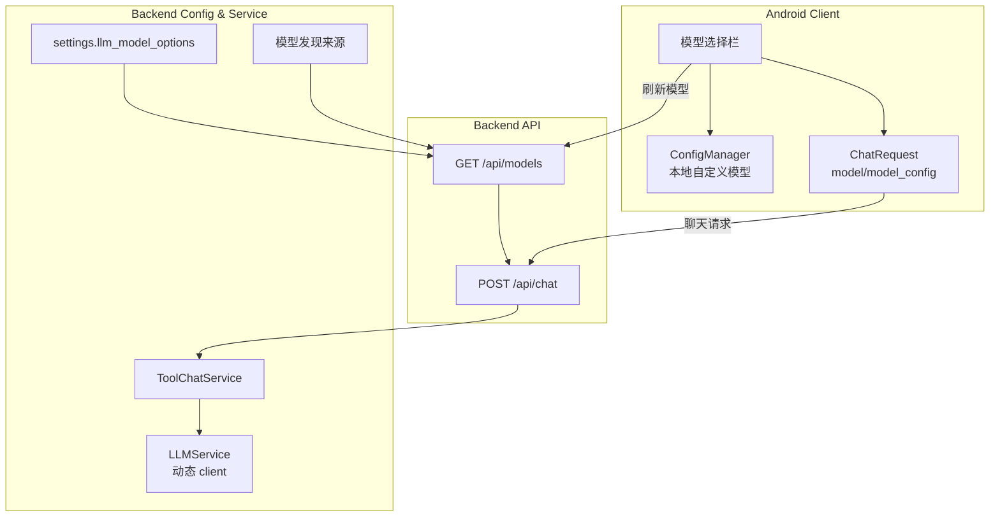

# 模型选择与自定义模型管理 - 变更说明

## 1. 高层摘要 (TL;DR)

*   **影响范围:** 🔴 **高** - 涉及后端模型配置、聊天接口、LLM 服务调用链与 Android 主聊天界面
*   **核心变更:**
    *   ✨ 新增服务端模型列表接口，Android 端可刷新并选择服务端提供的模型
    *   📱 新增当前模型选择栏，支持一键切换模型
    *   🔧 支持本机自定义 OpenAI-compatible 模型配置
    *   ✅ 支持编辑、删除已添加的自定义模型
    *   🛡️ 修复自定义模型同 ID 时误影响服务端模型切换的问题

---

## 2. 问题背景

### 2.1 原有问题

| 问题点 | 描述 | 影响 |
| --- | --- | --- |
| 服务端模型不可见 | Android 端没有模型列表入口 | 用户无法确认当前使用的模型 |
| 模型切换不灵活 | 后端只按默认配置模型调用 | 调试和切换供应商成本高 |
| 自定义模型不可维护 | 添加后不能编辑或删除 | 配错 Base URL/API Key 后只能覆盖或遗留无效配置 |
| 字段含义不清晰 | 名称、来源、模型 ID、Base URL、API Key 混在一个表单里 | 用户不清楚哪些字段会实际影响请求 |

### 2.2 目标

- 服务端集中声明可选模型，客户端只展示公开字段。
- Android 端可以一键切换服务端模型。
- 用户可在本机添加、编辑、删除自定义模型连接信息。
- 自定义模型必须显式提供实际请求所需的模型 ID、Base URL 和 API Key。

---

## 3. 解决方案架构



---

## 4. 详细变更分析

### 4.1 后端配置层 (`backend/config/settings.py`)

**新增能力:**

| 能力 | 说明 |
| --- | --- |
| `available_llm_models` | 声明服务端固定可选模型 |
| `llm_model_options` | 归一化字符串/字典两类模型配置 |
| `llm_model_discovery_sources` | 支持从 OpenAI-compatible `/models` 自动发现模型 |
| `get_llm_model_option()` | 根据模型 ID 找到服务端连接配置 |
| `api_key_env` | 支持从真实环境变量或 `backend/.env` 读取模型 API Key |

**配置示例:**

```python
available_llm_models = [
    {
        "id": "ep-20260514111645-lmgt2",
        "name": "豆包导购助手",
        "source": "火山方舟",
        "base_url": "https://ark.cn-beijing.volces.com/api/v3",
        "api_key_env": "ARK_API_KEY",
    },
]
```

---

### 4.2 后端 API 层 (`backend/api/chat.py`)

**新增数据模型:**

```python
class ModelConnectionConfig(BaseModel):
    id: str
    name: Optional[str] = None
    source: str = "local"
    base_url: Optional[str] = None
    api_key: Optional[str] = None

class ModelsResponse(BaseModel):
    default_model: str
    models: List[ModelInfo]
```

**新增/扩展接口:**

| 端点 | 方法 | 功能 |
| --- | --- | --- |
| `/api/models` | GET | 返回服务端可选模型与默认模型 |
| `/api/chat` | POST | 支持 `model` 与 `model_config` 字段 |

**关键逻辑:**

- 服务端模型优先从 `settings.llm_model_options` 获取。
- 自动发现模型可按 allow/deny pattern 过滤，并可折叠常见模型变体。
- 聊天接口根据请求中的 `model` 查找服务端配置；若带有本地 `model_config`，则优先使用本地配置。
- 未找到模型时通过流式响应返回明确错误。

---

### 4.3 后端服务层

#### 4.3.1 `backend/service/llm_service.py`

**核心变更:**

| 方法 | 变更 |
| --- | --- |
| `_resolve_client()` | 根据本轮模型配置选择默认 client 或创建临时 client |
| `chat()` | 支持传入 `model` / `model_config` |
| `chat_stream()` | 支持按指定模型流式输出 |
| `chat_with_tools()` | 工具调用流程支持指定模型 |
| `chat_stream_with_thinking()` | 思考流式输出支持指定模型 |

#### 4.3.2 `backend/service/tool_chat_service.py`

**核心变更:**

- 工具对话入口支持 `model` 与 `model_config` 参数。
- 需求分析、工具调用、最终回复阶段统一透传模型配置。
- 当全局 LLM 未连接但本地模型配置提供 API Key 时，允许继续调用。

---

### 4.4 Android 客户端

#### 4.4.1 主界面模型选择

**修改文件:** [MainActivity.kt](../../android_app/app/src/main/java/com/example/agentchat/MainActivity.kt)

**新增能力:**

| 功能 | 说明 |
| --- | --- |
| 当前模型栏 | 显示当前模型名称和来源 |
| 刷新模型列表 | 点击模型栏请求 `/api/models` |
| 分组展示 | 区分“服务器提供的模型”和“用户自定义模型” |
| 一键切换 | 点击模型行直接切换 |
| 自定义模型管理 | 自定义行右侧提供编辑、删除图标 |

#### 4.4.2 本地模型配置

**修改文件:** [ConfigManager.kt](../../android_app/app/src/main/java/com/example/agentchat/ConfigManager.kt)

**新增方法:**

| 方法 | 功能 |
| --- | --- |
| `getCustomModels()` | 读取本机自定义模型列表 |
| `saveCustomModel()` | 新增或编辑自定义模型 |
| `deleteCustomModel()` | 删除自定义模型并清理选中状态 |
| `hasCustomModel()` | 判断指定模型 ID 是否存在于本机配置 |

#### 4.4.3 表单说明与校验

自定义模型表单明确区分字段用途：

| 字段 | 用途 |
| --- | --- |
| 显示名称 | 仅用于列表显示 |
| 来源 | 仅用于列表显示 |
| 模型 ID | 实际请求模型参数 |
| Base URL | 实际请求服务地址 |
| API Key | 实际请求鉴权信息，仅保存在本机 |

**校验规则:**

- 模型 ID 不能为空。
- Base URL 不能为空，并且必须以 `http://` 或 `https://` 开头。
- API Key 不能为空。
- 新增/编辑时不能与现有自定义模型 ID 冲突。

---

### 4.5 资源文件变更

| 文件 | 变更 |
| --- | --- |
| `android_app/app/src/main/res/layout/activity_main.xml` | 新增当前模型选择栏与自定义 Toolbar 标题 |

---

## 5. 文件清单

| 文件 | 类型 | 说明 |
| --- | --- | --- |
| `backend/api/chat.py` | 修改 | 新增模型列表接口，聊天请求支持模型配置 |
| `backend/config/settings.py` | 修改 | 新增服务端模型配置、模型发现和 API Key 解析 |
| `backend/service/llm_service.py` | 修改 | 支持按模型配置创建调用 client |
| `backend/service/tool_chat_service.py` | 修改 | 工具聊天全流程透传模型配置 |
| `android_app/app/src/main/java/com/example/agentchat/MainActivity.kt` | 修改 | 新增模型选择栏、自定义模型管理 UI |
| `android_app/app/src/main/java/com/example/agentchat/ConfigManager.kt` | 修改 | 持久化自定义模型配置 |
| `android_app/app/src/main/res/layout/activity_main.xml` | 修改 | 新增当前模型区域 |
| `test/test_tool_chat_service_streaming.py` | 修改 | 测试桩兼容新增模型参数 |

---

## 6. 影响与风险评估

### 6.1 兼容性

| 组件 | 兼容性说明 |
| --- | --- |
| 旧聊天请求 | 未传 `model` 时仍使用服务端默认模型 |
| 服务端模型配置 | 可继续通过全局 `llm_model` 兜底 |
| Android 本地配置 | 自定义模型保存在本机 SharedPreferences |

### 6.2 潜在风险

| 风险项 | 描述 | 缓解措施 |
| --- | --- | --- |
| 模型 ID 配置错误 | 服务端或自定义模型 ID 不可调用 | `/api/chat` 返回明确错误，Android 可重新选择 |
| API Key 缺失 | 服务端模型或自定义模型无鉴权信息 | 支持 `api_key_env`，自定义模型表单强制填写 |
| 同 ID 冲突 | 用户自定义模型 ID 与服务端模型一致 | 列表中服务端模型优先，自定义重复项不重复展示 |

---

## 7. 用户使用说明

### 7.1 切换服务端模型

1. 在聊天主界面点击“当前模型”区域。
2. 等待模型列表刷新。
3. 在“服务器提供的模型”分组中点击目标模型行。
4. 模型栏显示新模型名称后，后续消息使用该模型。

### 7.2 添加自定义模型

1. 点击“当前模型”区域。
2. 点击“添加自定义模型...”。
3. 填写模型 ID、Base URL、API Key。
4. 可选填写显示名称和来源。
5. 点击“添加”，应用会保存并切换到该模型。

### 7.3 编辑或删除自定义模型

1. 打开模型选择列表。
2. 在“用户自定义模型”分组中找到目标模型。
3. 点击右侧编辑图标修改配置，或点击删除图标移除配置。
4. 点击模型行本身仍然是直接切换模型。

---

## 8. 测试验证

| 验证项 | 状态 |
| --- | --- |
| Android Debug 编译 | ✅ 已通过 `:app:assembleDebug` |
| 工具聊天测试桩参数兼容 | ✅ 已同步更新 |
| 服务端模型误判为自定义模型 | ✅ 已修复 |

