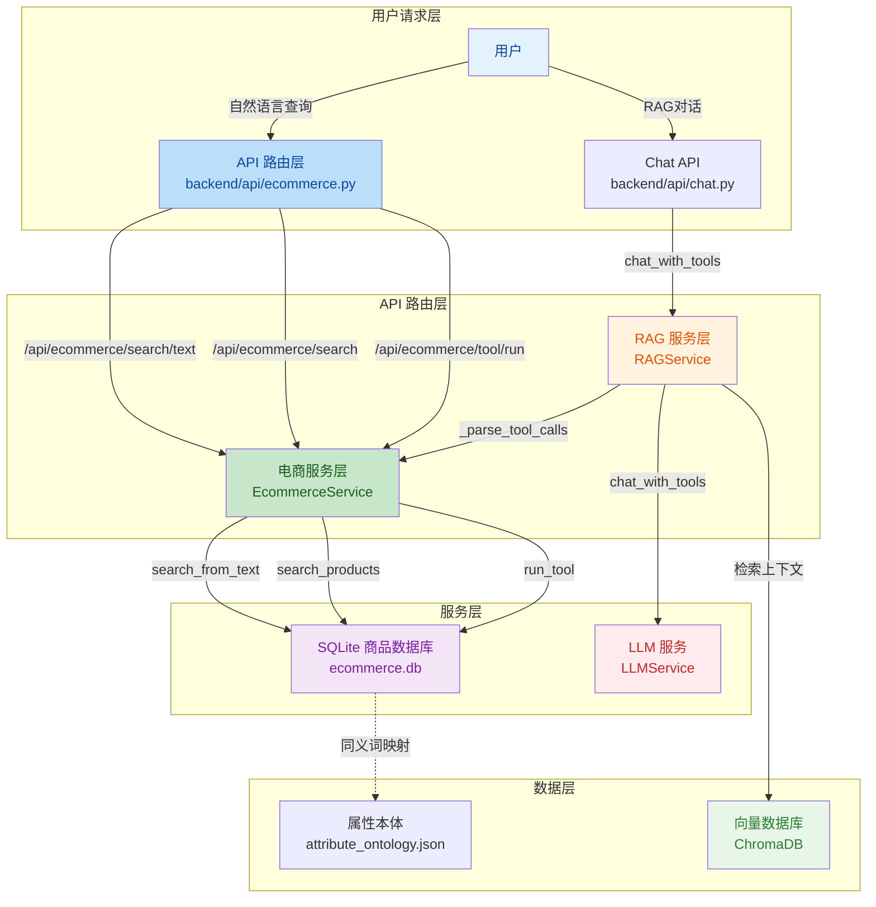
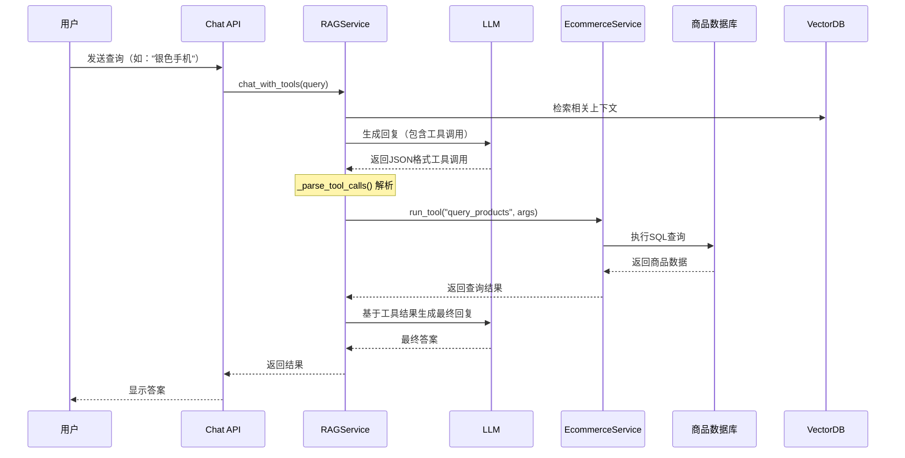

## 1. 高层摘要 (TL;DR)

*   **影响范围:** 🟡 **中等** - 在现有RAG系统中集成了完整的电商商品查询功能，新增了API路由、服务层和工具调用能力
*   **核心变更:**
    *   ✨ 新增 **EcommerceService** 服务层，封装商品数据库查询逻辑
    *   🔌 新增 **电商API路由** (`/api/ecommerce`)，提供自然语言搜索和结构化查询接口
    *   🤖 在 **RAGService** 中集成 **工具调用机制**，支持LLM自动调用电商查询工具
    *   ⚙️ 配置文件新增电商数据库路径配置
    *   🧪 新增电商服务测试脚本

---

## 2. 可视化概览 (业务逻辑架构)



### 工具调用流程



---

## 3. 详细变更分析

### 📦 组件一: 配置管理

**文件:** `backend/config/settings.py`

**变更内容:**
- 新增电商数据库路径配置项 `ecommerce_db_path`，默认指向 `../ecommerce_agent_dataset/ecommerce.db`

| 配置项 | 类型 | 默认值 | 说明 |
|--------|------|--------|------|
| `ecommerce_db_path` | `str` | `"../ecommerce_agent_dataset/ecommerce.db"` | 电商SQLite数据库文件路径 |

---

### 🚀 组件二: 应用启动集成

**文件:** `backend/main.py`

**变更内容:**
- 导入 `ecommerce_service` 和 `ecommerce_router`
- 在 `lifespan()` 生命周期管理中添加电商服务的初始化和清理
- 注册电商路由到FastAPI应用

| 生命周期阶段 | 操作 | 代码位置 |
|-------------|------|---------|
| 启动时 | `ecommerce_service.initialize()` | 第35行 |
| 关闭时 | `ecommerce_service.close()` | 第46行 |
| 路由注册 | `app.include_router(ecommerce_router)` | 第71行 |

---

### 🤖 组件三: RAG服务增强

**文件:** `backend/service/rag_service.py`

**核心变更:**

#### 3.1 工具调用机制
- 新增 `chat_with_tools()` 方法，支持LLM自动调用工具
- 新增 `_parse_tool_calls()` 方法，解析LLM返回的JSON格式工具调用
- 新增 `register_tool()` 方法，注册可用工具

#### 3.2 工具调用流程
```python
# 伪代码展示核心逻辑
async def chat_with_tools(user_query, conversation_history, max_tool_calls=5):
    for _ in range(max_tool_calls):
        reply = await llm.chat(messages)  # LLM生成回复
        tool_calls = _parse_tool_calls(reply)  # 解析工具调用
        
        if not tool_calls:
            return reply  # 无工具调用，直接返回
        
        # 执行工具调用
        for tool_call in tool_calls:
            result = ecommerce_service.run_tool(tool_name, arguments)
            tool_results.append(result)
        
        # 将工具结果反馈给LLM
        messages.append({"role": "user", "content": tool_result_text})
    
    return reply
```

#### 3.3 代码清理
- 移除了大量冗余的注释和空行
- 简化了初始化和清理函数的日志输出

---

### 🔌 组件四: 电商API路由 (新增)

**文件:** `backend/api/ecommerce.py` (全新文件)

**提供的接口:**

| 端点 | 方法 | 功能 | 参数 |
|------|------|------|------|
| `/api/ecommerce/search/text` | GET | 自然语言搜索 | `text`, `limit`, `show_skus` |
| `/api/ecommerce/search` | POST | 结构化搜索 | `keyword`, `brand`, `category`, `sub_category`, `attr_filters`, `limit`, `show_skus` |
| `/api/ecommerce/search` | GET | 结构化搜索(GET方式) | 同上（通过Query参数） |
| `/api/ecommerce/tool/spec` | GET | 获取工具规范 | 无 |
| `/api/ecommerce/tool/run` | POST | 执行工具调用 | `tool_name`, `arguments` |
| `/api/ecommerce/health` | GET | 健康检查 | 无 |

**请求模型示例:**

```python
class ProductTextSearchRequest(BaseModel):
    text: str              # 自然语言查询
    limit: int = 10        # 返回数量
    show_skus: bool = False  # 是否显示SKU详情

class ToolCallRequest(BaseModel):
    tool_name: str
    arguments: Optional[Dict[str, any]] = None
```

---

### 🛒 组件五: 电商服务层 (新增)

**文件:** `backend/service/ecommerce_service.py` (全新文件)

**核心类:** `EcommerceService`

#### 5.1 主要方法

| 方法名 | 功能 | 返回值 |
|--------|------|--------|
| `initialize()` | 初始化服务，检查数据库可用性 | `None` |
| `search_from_text()` | 自然语言查询商品 | `dict` (包含 `ok`, `items`, `total` 等) |
| `search_products()` | 结构化参数查询商品 | `dict` |
| `get_tool_spec()` | 获取OpenAI工具调用规范 | `dict` |
| `run_tool()` | 执行工具调用 | `dict` |
| `_normalize_attr_filters()` | 标准化属性过滤器格式 | `List[Dict]` |

#### 5.2 工具调用规范
返回符合OpenAI Function Calling格式的规范，供LLM使用：

```json
{
  "type": "function",
  "function": {
    "name": "query_products",
    "description": "查询本地电商 SQLite 数据库，可以使用自然语言或结构化过滤器。",
    "parameters": {
      "type": "object",
      "properties": {
        "text": {"type": "string"},
        "keyword": {"type": ["string", "null"]},
        "brand": {"type": ["string", "null"]},
        "category": {"type": ["string", "null"]},
        "attr_filters": {"type": "array"},
        "limit": {"type": "integer", "default": 10},
        "show_skus": {"type": "boolean", "default": false}
      }
    }
  }
}
```

#### 5.3 降级策略
当数据库不可用时，服务会返回模拟数据而非报错：

```python
def _mock_search_from_text(self, text: str, limit: int, show_skus: bool):
    return {
        "ok": True,
        "total": 0,
        "items": [],
        "message": "电商数据库未配置，返回模拟结果。"
    }
```

---

### 🧪 组件六: 测试脚本 (新增)

**文件:** `backend/test_ecommerce.py` (全新文件)

**测试覆盖场景:**

| 测试项 | 测试内容 |
|--------|---------|
| 服务初始化 | 验证数据库可用性和路径 |
| 自然语言搜索 | 测试 `search_from_text("银色手机")` |
| 结构化搜索 | 测试 `search_products(keyword="手机")` |
| 工具调用 | 测试 `run_tool("query_products", {...})` |
| 工具规范 | 验证 `get_tool_spec()` 返回格式 |
| 错误处理 | 测试未知工具调用 |

---

## 4. 影响与风险评估

### ⚠️ 破坏性变更
- **无** - 本次变更为纯增量添加，未修改现有API或数据结构

### 🔍 测试建议

#### 功能测试
1. **自然语言搜索测试**
   ```bash
   curl "http://localhost:8000/api/ecommerce/search/text?text=银色手机&limit=5"
   ```

2. **结构化搜索测试**
   ```bash
   curl -X POST "http://localhost:8000/api/ecommerce/search" \
     -H "Content-Type: application/json" \
     -d '{"keyword": "手机", "limit": 3}'
   ```

3. **工具调用测试**
   ```bash
   curl -X POST "http://localhost:8000/api/ecommerce/tool/run" \
     -H "Content-Type: application/json" \
     -d '{"tool_name": "query_products", "arguments": {"text": "红色笔记本电脑"}}'
   ```

4. **RAG对话测试** (验证工具调用集成)
   - 发送包含商品查询意图的消息，验证LLM是否能正确调用工具

#### 边界场景测试
- 数据库文件不存在时的降级行为
- 无效的工具名称或参数
- 空查询结果的处理
- 并发查询的性能表现

### 🎯 性能考量
- **数据库查询:** SQLite查询性能取决于数据量和索引情况
- **工具调用循环:** `max_tool_calls=5` 限制防止无限循环，但复杂查询可能需要多次LLM调用
- **建议:** 对高频查询添加缓存机制

### 🔒 安全建议
- 验证用户输入的 `limit` 参数（已限制在1-100范围）
- 考虑添加API访问频率限制
- 数据库路径应通过环境变量配置，避免硬编码

---

## 5. 依赖关系

新增的外部依赖（通过 `sys.path` 动态导入）:

| 模块 | 来源 | 用途 |
|------|------|------|
| `query_sqlite_with_synonyms` | `ecommerce_agent_dataset/` | 商品数据库查询核心逻辑 |
| `attribute_ontology.json` | `ecommerce_agent_dataset/` | 属性同义词映射 |

---

## 总结

本次变更成功将电商查询能力集成到现有RAG系统中，通过工具调用机制实现了LLM与商品数据库的交互。架构设计清晰，API接口完善，并提供了良好的降级策略。建议在生产环境部署前进行充分的集成测试和性能优化。