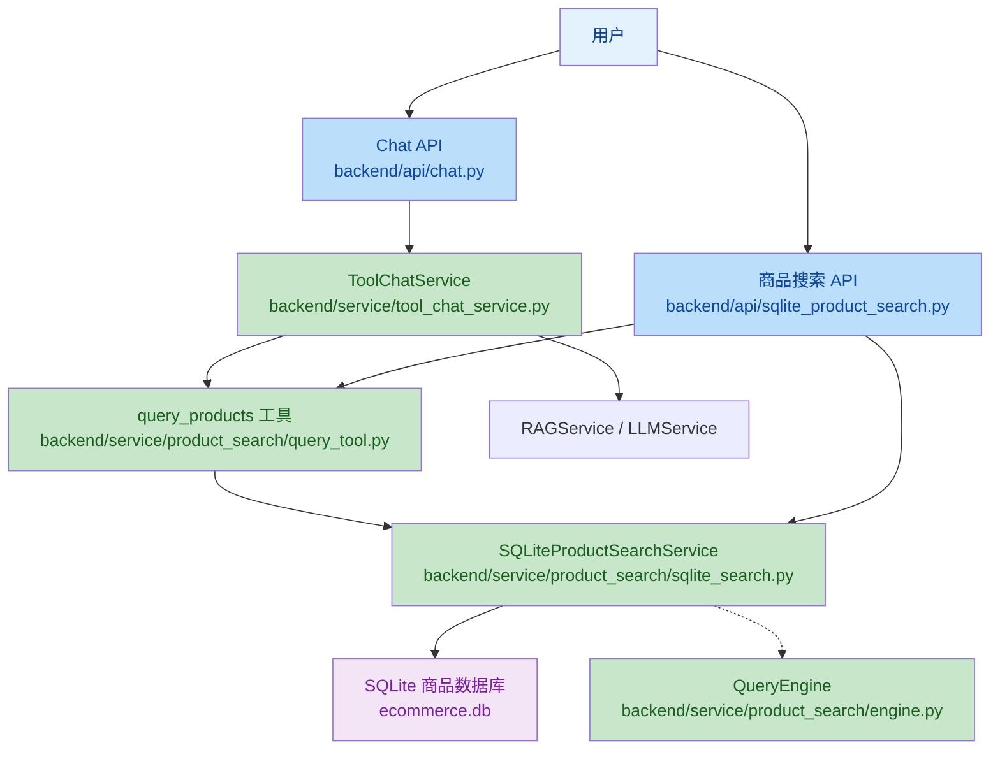

# 电商数据库服务演进说明

## 1. 当前实现对照

这份文档保留“电商数据库服务”的历史标题，但当前代码已经演进为商品搜索模块 + 导购工具链路，并不再使用旧的 `EcommerceService` 命名。

| 旧写法 | 当前实现 |
|------|------|
| `backend/api/ecommerce.py` | `backend/api/sqlite_product_search.py` |
| `/api/ecommerce/*` | `/api/product-search/*` |
| `EcommerceService` | `backend/service/product_search/sqlite_search.py` 中的 `sqlite_product_search_service` |
| `query_engine.py` | `backend/service/product_search/engine.py` |
| 工具分发层 | `backend/service/product_search/query_tool.py` |
| 直接在 RAG 中拼商品查询 | `backend/service/tool_chat_service.py` 统一编排 |

---

## 2. 高层摘要

*   **影响范围:** 🟡 **中等** - 商品查询能力已落到独立的 SQLite 搜索模块，并作为导购链路内的工具能力接入聊天服务
*   **核心能力:**
    *   ✨ 支持自然语言商品搜索和结构化商品搜索
    *   🔌 暴露 `/api/product-search/*` 供调试、联调和页面跳转使用
    *   🤖 通过 `query_products` 工具接入导购聊天链路
    *   ⚙️ 商品数据库路径由 `settings.sqlite_product_db_path` 统一配置
    *   🧪 保留健康检查、工具规范和商品详情页面接口

---

## 3. 业务逻辑架构



---

## 4. 当前接口说明

| 端点 | 方法 | 功能 |
|------|------|------|
| `/api/product-search/search/text` | GET | 自然语言搜索 |
| `/api/product-search/search` | POST | 结构化搜索 |
| `/api/product-search/search` | GET | 结构化搜索（Query 参数） |
| `/api/product-search/tool/spec` | GET | 获取工具规范 |
| `/api/product-search/tool/run` | POST | 执行工具调用 |
| `/api/product-search/health` | GET | 健康检查 |
| `/api/product-search/products/{product_id}` | GET | 商品详情 |
| `/api/product-search/products/{product_id}/page` | GET | 商品落地页 |

---

## 5. 模块职责

### 5.1 `backend/service/product_search/sqlite_search.py`

负责真实商品查询逻辑，包括：
- 自然语言解析后的检索
- 结构化条件查询
- 商品详情、SKU、FAQ、评价与图片信息聚合
- 数据库可用性检查

### 5.2 `backend/service/product_search/query_tool.py`

负责将商品查询能力包装成 OpenAI Function Calling 工具：
- 输出 `query_products` 工具规范
- 执行工具调用并返回结果
- 对输入参数做基本校验和分流

### 5.3 `backend/service/product_search/engine.py`

负责查询语义层：
- 品牌、类目、属性同义词解析
- SearchPlan 辅助字段处理
- 查询条件标准化

### 5.4 `backend/service/tool_chat_service.py`

负责把商品工具接到导购聊天主链路中：
- 接收用户问题和历史对话
- 并行执行需求分析、RAG 检索和商品直查
- 通过 `query_products` 工具补充结构化商品结果
- 汇总 `selected_products` 和最终回复

---

## 6. 验证方式

```bash
curl "http://localhost:8000/api/product-search/search/text?text=银色手机&limit=5"
curl -X POST "http://localhost:8000/api/product-search/search" \
  -H "Content-Type: application/json" \
  -d '{"keyword":"手机","limit":3}'
curl "http://localhost:8000/api/product-search/tool/spec"
curl -X POST "http://localhost:8000/api/product-search/tool/run" \
  -H "Content-Type: application/json" \
  -d '{"tool_name":"query_products","arguments":{"text":"红色笔记本电脑"}}'
```

---

## 7. 结论

当前实现已经从“单独的电商服务层”演进为“商品搜索模块 + 导购工具链路”的组合。文档中如果仍看到 `EcommerceService`、`/api/ecommerce/*` 或 `backend/api/ecommerce.py`，应视为旧方案描述，不代表当前代码现状。
