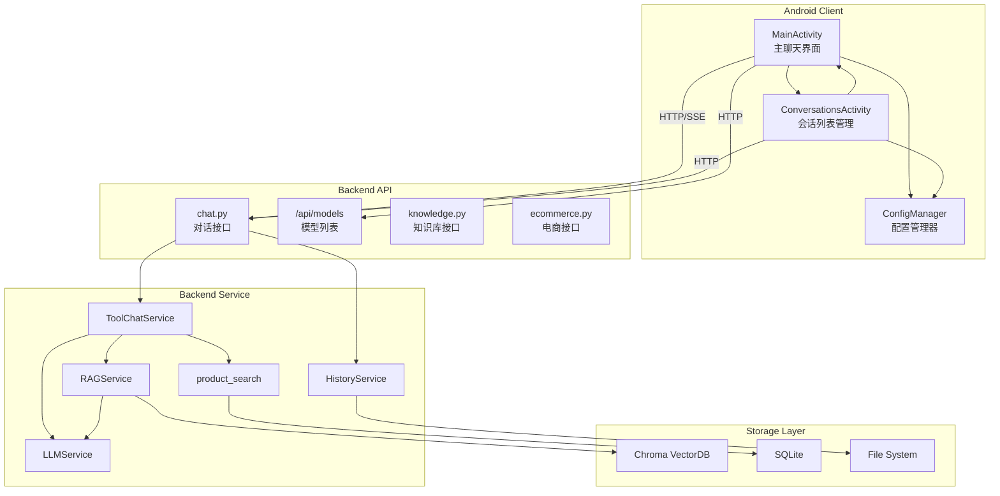

# Agent 对话应用 - 项目介绍说明

## 一、项目概述

本项目是一个完整的 **RAG (Retrieval-Augmented Generation) 智能对话应用系统**，采用前后端分离架构，支持多对话管理、知识库检索、工具调用等核心能力。

### 技术栈

| 层级 | 技术 | 版本/说明 |
|------|------|-----------|
| 后端框架 | FastAPI | Python 3.10+ |
| 向量数据库 | Chroma | 本地持久化 |
| 向量化模型 | Chroma 默认 / 火山方舟多模态 Embedding | 后端固定配置，Android 端展示状态 |
| 大模型 | 火山方舟 / OpenAI-compatible | 支持流式响应与模型切换 |
| 移动端 | Kotlin | 100% 原生 Android |

### 核心能力

✅ 多对话管理（新建、切换、删除会话）  
✅ RAG 知识库检索  
✅ 需求分析折叠展示（中间层解释层）  
✅ 流式响应支持  
✅ Markdown 渲染与文本选择  
✅ 回复一键复制  
✅ 后端地址可配置化  
✅ 服务端模型选择与本机自定义模型管理  
✅ 外部向量化模型接入与状态展示
✅ 电商商品查询工具集成  
✅ 全链路性能监控  
✅ 流式任务取消与断连历史保存
✅ 对话历史并发安全写入
✅ LLM 搜索计划与商品匹配优化
✅ 语义表驱动的商品搜索业务知识注入
✅ 商品落地页重构（SKU 规格选择、FAQ、用户评价）
✅ SearchPlan 类目枚举校验与工具参数自动补全
✅ RAG 候选商品纳入推荐池与流式引导文字

---

## 二、项目架构

### 2.1 系统架构图



### 2.2 项目目录结构

```
ragApp/
├── backend/                    # FastAPI 后端服务
│   ├── api/                    # API 路由层
│   │   ├── chat.py            # 对话相关接口
│   │   ├── knowledge.py       # 知识库管理接口
│   │   └── ecommerce.py       # 电商查询接口
│   ├── config/                # 配置管理
│   │   └── settings.py        # 环境变量配置
│   ├── service/               # 业务逻辑层
│   │   ├── __init__.py        # 服务初始化与公共服务对象导出
│   │   ├── llm_service.py     # LLM 服务
│   │   ├── rag_service.py     # 通用 RAG / Embedding / VectorStore 服务
│   │   ├── history_service.py # 对话历史服务
│   │   ├── tool_chat_service.py # 导购工具聊天对外入口
│   │   ├── tool_chat/         # 工具聊天内部模块
│   │   └── product_search/    # 商品检索内部模块
│   ├── main.py                # 后端主入口
│   ├── requirements.txt       # Python 依赖
│   └── .env.example          # 环境变量模板
├── android_app/               # Kotlin Android 原生应用
│   ├── app/src/main/java/com/example/agentchat/
│   │   ├── MainActivity.kt              # 主界面入口
│   │   ├── ChatAdapter.kt               # 聊天列表适配器
│   │   ├── ConversationsActivity.kt     # 对话列表页面
│   │   └── ConfigManager.kt             # 配置管理
│   └── app/src/main/res/layout/         # UI 布局文件
├── ecommerce_agent_dataset/   # 电商数据集
├── docs/                      # 文档目录
│   ├── 变更摘要/              # 变更记录文档
│   ├── 后端服务文件查找说明.md # 后端服务代码导航
│   └── 变更摘要文档撰写规范.md # 文档规范
├── test/                      # 测试脚本
├── CHANGELOG.md               # 变更日志
└── README.md                  # 项目说明
```

---

## 三、功能特性详解

### 3.1 多对话管理

**功能描述**: 支持创建、切换、删除多个独立对话会话

**实现要点**:
- 后端采用目录化存储结构（`user_{hash}/conv_{id}.json`）
- 会话元数据存储在 `meta.json`
- 支持会话标题更新、消息计数统计

**API 端点**:
| 端点 | 方法 | 功能 |
|------|------|------|
| `/conversations/{user_id}` | POST | 创建会话 |
| `/conversations/{user_id}` | GET | 获取会话列表 |
| `/conversations/{user_id}/switch/{conv_id}` | POST | 切换会话 |
| `/conversations/{user_id}/{conv_id}` | DELETE | 删除会话 |

### 3.2 需求分析折叠展示

**功能描述**: 在助手消息内嵌可折叠的需求分析区域，用户可按需展开查看分析内容

**实现要点**:
- 需求分析由独立的中间层阶段生成，作为中间层解释层
- 分析结果为空时自动降级为简化分析兜底
- 助手消息支持 Markdown 渲染（Markwon 库）
- 新增"复制回复"按钮，一键复制助手回复

**用户体验**:
- 助手回复上方展示"已思考"折叠区域，点击展开查看完整分析
- 分析区域显示耗时信息
- 所有消息支持长按选择文本进行复制

### 3.3 后端地址可配置化

**功能描述**: 支持动态配置后端服务器地址，无需重新编译

**实现要点**:
- 新增 `ConfigManager` 单例管理配置
- 使用 `SharedPreferences` 持久化存储
- URL 格式验证（必须以 http:// 或 https:// 开头）

**支持地址格式**:
- 局域网 IP: `http://192.168.1.100:8000`
- 模拟器本地: `http://10.0.2.2:8000`
- HTTPS: `https://api.example.com`

### 3.4 电商商品查询工具

**功能描述**: 集成电商数据库查询能力，支持 LLM 自动调用工具

**实现要点**:
- 新增 `EcommerceService` 封装数据库查询逻辑
- 支持自然语言搜索和结构化查询
- 符合 OpenAI Function Calling 规范

**API 端点**:
| 端点 | 方法 | 功能 |
|------|------|------|
| `/api/ecommerce/search/text` | GET | 自然语言搜索 |
| `/api/ecommerce/search` | POST | 结构化搜索 |
| `/api/ecommerce/tool/run` | POST | 执行工具调用 |

### 3.5 性能监控

**功能描述**: 全链路耗时统计，便于问题排查和优化

**监控指标**:
| 指标 | 说明 |
|------|------|
| `vector_search` | 向量检索耗时 |
| `rag_rerank` | LLM RAG 片段核验耗时 |
| `llm_calls` | LLM 推理总耗时 |
| `llm_rounds` | LLM 调用轮数 |
| `tool_calls` | 工具查询总耗时 |
| `tool_rounds` | 工具调用轮数 |
| `total` | 总耗时 |

**并行流程说明**:
- 调试测试会同时展示“各阶段串行相加”和“并行重叠节省估算”
- 并行流程下各阶段耗时可能存在重叠，不再要求各项相加等于总耗时

### 3.6 模型选择与自定义模型管理

**功能描述**: 支持 Android 端查看服务端提供的模型列表，并在本机添加、编辑、删除 OpenAI-compatible 自定义模型。

**实现要点**:
- 后端新增 `/api/models` 返回服务端可选模型和默认模型
- `settings.available_llm_models` 支持声明模型 ID、显示名称、来源、Base URL 和 API Key 环境变量
- 聊天接口支持 `model` 与 `model_config` 字段
- Android 主界面新增当前模型栏，点击后可刷新并切换模型
- 自定义模型配置保存在本机 SharedPreferences

**用户体验**:
- 服务端模型点击一次即可切换
- 自定义模型行右侧提供编辑、删除图标
- 显示名称和来源仅用于展示，模型 ID、Base URL、API Key 会实际参与请求

### 3.7 导购流程并行化与目标商品白名单

**功能描述**: 将导购聊天中的需求分析、商品查询规划、SQLite 直查和 RAG 检索核验拆分为可并行执行的分支，并在最终回复前由后端生成结构化目标商品白名单。

**实现要点**:
- 需求分析 prompt 只基于用户问题和历史对话，不依赖知识库上下文
- 商品查询规划 prompt 独立于 RAG，可作为 RAG 未命中时的商品数据库兜底
- 最终导购回复 prompt 负责整合目标商品白名单、工具查询结果、RAG 补充信息和需求分析摘要
- `selected_products` 返回 `rank`、`source`、`recommendation_role` 等结构化字段

**流程收益**:
- 减少需求分析、工具规划和 RAG 链路之间的串行等待
- 降低最终回复编造商品 ID 的风险
- 为 Android 端或其他外部系统展示目标商品卡片提供稳定数据结构

### 3.8 RAG 商品知识来源与核验

**功能描述**: RAG 向量检索现在返回商品来源 metadata，并通过流式接口透传给客户端或调试工具，用于核验最终推荐所参考的知识片段。

**实现要点**:
- 默认 Chroma 数据库路径指向 `ecommerce_agent_dataset/.chroma`
- 默认集合名为 `product_knowledge`
- 向量检索结果包含 `product_id`、`title`、`category`、`sub_category`、`chunk_type` 和 `distance`
- RAG 片段可通过 LLM 核验、重排和过滤
- 流式接口新增 `rag_sources` 事件，便于前端或日志展示知识来源

### 3.9 后端稳定性与测试同步

**功能描述**: 后端聊天链路增加并发安全、断连保存和后台任务取消能力，并将测试口径同步到正式版结构化事件。

**实现要点**:
- 对话历史 JSON 写入增加文件锁和原子写入
- 流式响应在异常或客户端断连后保存已生成回复
- 流式后台任务通过统一任务组追踪并取消未完成任务
- 工具聊天服务按流式 Pipeline、RAG、prompt、目标商品选择和 trace 格式化收拢到 `backend/service/tool_chat/` 职责型子包，流式链路继续细分为上下文、基础阶段、工具循环和最终回复模块
- 商品检索实现收拢到 `backend/service/product_search/` 职责型子包，区分 ontology 查询引擎、SQLite 搜索服务和 Function Calling 工具
- 新增 `docs/后端服务文件查找说明.md`，长期维护后端服务文件定位规则和常见问题查找入口
- 商品查询 ontology 和反向索引增加缓存
- RAG 测试以 metadata 和调试 trace 为准，不再依赖旧版格式化文本

**后续方向**:
- 当前 RAG 向量模型召回质量仍偏弱，后续计划升级 embedding / rerank 模型
- 继续细化流式工具循环中的工具计划解析、结果归档和候选提前退出判断

### 3.10 外部向量化模型接入与状态展示

**功能描述**: RAG 向量化模型由后端固定配置，可选择 Chroma 默认本地 embedding 或火山方舟多模态 embedding，并在 Android 聊天页展示当前连接状态。

**实现要点**:
- 后端新增 `VolcengineMultimodalEmbeddingFunction`，对接 `/embeddings/multimodal`
- `EmbeddingService.get_status()` 通过 `/health` 返回 provider、model、base_url、dimensions、connected 等状态
- Chroma 构建脚本复用后端 embedding 配置，确保构建索引与线上查询使用同一向量模型
- Android 主界面新增“向量模型状态”文本，启动和刷新模型列表时自动检查后端健康状态

**配置说明**:
```bash
USE_EXTERNAL_EMBEDDING=true
EMBEDDING_MODEL=doubao-embedding-vision-251215
EMBEDDING_BASE_URL=https://ark.cn-beijing.volces.com/api/v3
EMBEDDING_DIMENSIONS=2048
EMBEDDING_API_KEY_ENV=ARK_API_KEY
```

**注意事项**:
- 切换 embedding 模型或维度后，需要重新构建 Chroma 索引
- Android 端只展示后端向量模型状态，不提供向量模型切换入口

### 3.11 LLM 搜索计划与商品匹配优化

**功能描述**: 新增 LLM 生成的搜索计划功能，用于结构化商品搜索和 direct/fallback 判定，同时改进关键词搜索算法和商品匹配逻辑，提升推荐准确性。

**实现要点**:
- 新增 `_build_search_plan_messages()` 构造搜索计划子任务消息
- 新增 `_normalize_search_plan()` 和 `_parse_search_plan_content()` 标准化和解析搜索计划
- 增强 `build_keyword_terms()` 算法，支持混合内容拆分和同义词扩展
- 新增 `strip_intent_words()` 移除导购问句中的语气词
- 新增 `score_keyword_match()` 为商品按关键词相关性打分
- 新增 `_is_direct_product_match()` 判断候选是否直接匹配用户点名的商品
- 新增 `_prefer_closest_fallbacks()` 在无直接匹配时选择最接近的替代品
- 改进 `_matches_user_product_constraints()` 支持基于搜索计划的品类过滤
- 增强系统提示词，规范 fallback 商品的描述

**流程收益**:
- 商品搜索更精准，能识别用户点名的具体商品
- 推荐结果更合理，直接匹配商品优先于替代品
- fallback 商品描述更准确，避免误导用户

---

## 四、核心变更记录

### 已完成的变更

| 变更文档 | 类型 | 影响范围 | 完成时间 |
|---------|------|---------|---------|
| [多对话页面](file:///home/fang/Documents/trae_projects/ragApp/docs/变更摘要/多对话页面.md) | 新功能 | 🔴 高 | 2026-05-24 |
| [思考过程持久化与显示优化](file:///home/fang/Documents/trae_projects/ragApp/docs/变更摘要/思考过程持久化与显示优化.md) | Bug修复 | 🟡 中 | 2026-05-24 |
| [后端地址可配置化](file:///home/fang/Documents/trae_projects/ragApp/docs/变更摘要/后端地址可配置化.md) | 功能改进 | 🟡 中 | 2026-05-24 |
| [电商数据库服务](file:///home/fang/Documents/trae_projects/ragApp/docs/变更摘要/电商数据库服务.md) | 新功能 | 🟡 中 | 2026-05-24 |
| [查询工具接入后端](file:///home/fang/Documents/trae_projects/ragApp/docs/变更摘要/查询工具接入后端.md) | 架构重构 | 🔴 高 | 2026-05-24 |
| [对话列表点击当前空对话误删除修复](file:///home/fang/Documents/trae_projects/ragApp/docs/变更摘要/对话列表点击当前空对话误删除修复.md) | Bug修复 | 🟢 低 | 2026-05-24 |
| [变更摘要文档规范更新](file:///home/fang/Documents/trae_projects/ragApp/docs/变更摘要/变更摘要文档规范更新.md) | 配置/工具 | 🟢 低 | 2026-05-28 |
| [导购聊天服务与流式交互优化](file:///home/fang/Documents/trae_projects/ragApp/docs/变更摘要/导购聊天服务与流式交互优化.md) | 新功能 | 🟡 中 | 2026-05-28 |
| [后端商品搜索服务优化](file:///home/fang/Documents/trae_projects/ragApp/docs/变更摘要/后端商品搜索服务优化.md) | 功能改进 | 🟡 中 | 2026-05-29 |
| [需求分析折叠展示与思考流程统一](file:///home/fang/Documents/trae_projects/ragApp/docs/变更摘要/需求分析折叠展示与思考流程统一.md) | 架构重构 | 🔴 高 | 2026-05-29 |
| [导购流程并行化与目标商品白名单](file:///home/fang/Documents/trae_projects/ragApp/docs/变更摘要/导购流程并行化与目标商品白名单.md) | 架构重构 | 🟡 中 | 2026-06-03 |
| [Android文本选取与会话切换稳定性修复](file:///home/fang/Documents/trae_projects/ragApp/docs/变更摘要/Android文本选取与会话切换稳定性修复.md) | Bug修复 | 🟡 中 | 2026-06-01 |
| [模型选择与自定义模型管理](file:///home/fang/Documents/trae_projects/ragApp/docs/变更摘要/模型选择与自定义模型管理.md) | 新功能 | 🔴 高 | 2026-06-02 |
| [后端服务优化与Android端稳定性改进](file:///home/fang/Documents/trae_projects/ragApp/docs/变更摘要/后端服务优化与Android端稳定性改进.md) | 功能优化 | 🟡 中 | 2026-06-03 |
| [后端稳定性与测试同步优化](file:///home/fang/Documents/trae_projects/ragApp/docs/变更摘要/后端稳定性与测试同步优化.md) | 稳定性修复 | 🟡 中 | 2026-06-07 |
| [外部向量化模型接入与状态展示](file:///home/fang/Documents/trae_projects/ragApp/docs/变更摘要/外部向量化模型接入与状态展示.md) | 功能改进 | 🟡 中 | 2026-06-08 |
| [LLM搜索计划与商品匹配优化](file:///home/fang/Documents/trae_projects/ragApp/docs/变更摘要/LLM搜索计划与商品匹配优化.md) | 功能改进 | 🟡 中 | 2026-06-08 |
| [语义表驱动的商品搜索业务知识注入](file:///home/fang/Documents/trae_projects/ragApp/docs/变更摘要/语义表驱动的商品搜索业务知识注入.md) | 功能改进 | 🟡 中 | 2026-06-08 |

---

## 五、快速开始指南

### 5.1 后端启动

```bash
cd backend
pip install -r requirements.txt
cp .env.example .env
# 编辑 .env 设置 LLM_API_KEY
python main.py
```

后端服务将运行在 `http://0.0.0.0:8000`

### 5.2 Android 应用开发

1. 用 Android Studio 打开 `android_app/` 目录
2. 点击右上角设置图标配置后端地址
3. 地址保存后立即生效，无需重新编译
4. 点击聊天页“当前模型”区域刷新和切换服务端模型，或添加本机自定义模型
5. 聊天页会自动展示后端当前向量模型状态

---

## 六、技术亮点

✨ **智能空会话清理**: 创建新会话时自动检查并删除当前空会话  
✨ **双重缓存机制**: 内存缓存 + SharedPreferences 持久化  
✨ **全链路性能监控**: 详细的耗时统计便于问题排查  
✨ **断路器机制**: 防止工具调用无限循环  
✨ **向后兼容设计**: 新旧数据格式无缝兼容  
✨ **优雅降级策略**: 数据库不可用时返回模拟数据  
✨ **多模型接入能力**: 服务端模型列表与本机自定义模型共存，便于调试不同供应商  
✨ **向量化模型后端固定配置**: 外部 embedding 与索引构建复用同一后端配置，Android 端只展示连接状态
✨ **流式稳定性保护**: 支持断连后保存已生成回复，并取消未完成后台任务
✨ **阶段化工具聊天服务**: 导购主链路已按流式入口、上下文、基础阶段、工具循环、最终回复、RAG、prompt、目标商品选择和 trace 格式化收拢到职责型子包
✨ **清晰的商品检索边界**: 商品检索已按查询引擎、SQLite 搜索服务和 Function Calling 工具收拢到 `product_search/` 子包

---

## 七、文档规范

项目采用标准化的变更摘要文档撰写规范，确保每次功能变更都有完整的记录：

- **文档位置**: `docs/变更摘要/`
- **命名规范**: `功能特性描述.md`
- **版本选择**: 大型功能使用完整版，Bug修复使用简洁版
- **更新时机**: 每次功能完成后必须更新 CHANGELOG.md
- **尾注同步**: 每次更新项目介绍说明时，必须同步维护文档末尾的文档版本、生成时间和项目状态

---

## 八、未来规划

| 优先级 | 功能 | 状态 |
|--------|------|------|
| 高 | 用户认证系统 | 待规划 |
| 中 | 消息通知推送 | 待规划 |
| 中 | 模型连接健康检查 | 待规划 |
| 中 | RAG 向量模型与重排模型升级 | 待规划 |
| 低 | 数据导出功能 | 待规划 |

---

**文档版本**: v1.1.1
**生成时间**: 2026-06-09
**项目状态**: 活跃开发中
